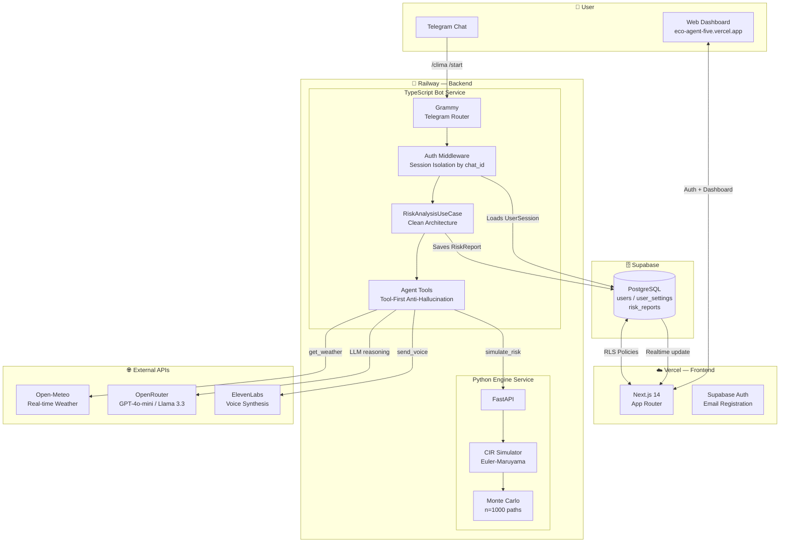

# 🌍 EcoAgent: AI-Powered Stochastic Climate Risk Platform

*A production SaaS system for real-time landslide risk prediction, 
combining stochastic differential equations with LLM orchestration 
and multimodal alerts.*

[](https://eco-agent-five.vercel.app)
[](https://www.typescriptlang.org/)
[](https://www.python.org/)
[](https://www.docker.com/)

---

## 🐇 Velveteen Family Coherence
EcoAgent is an operational product of **The Velveteen Project**. While it maintains its own specific identity as an applied climate monitoring system, it adheres to the family's core values: technical rigor, premium restraint, and an anti-hype posture.

For details on the current design alignment and planned refinements, see the [EcoAgent Brand Coherence & Pruning Audit](docs/ecoagent-pruning-audit.md).

---

## 🎯 The Problem

Mountainous regions like **Manizales, Colombia** face constant 
landslide threats from rain-induced soil saturation. Traditional 
alerting systems rely on static thresholds that ignore the 
stochastic nature of soil moisture dynamics.

**EcoAgent** models soil saturation as a mean-reverting stochastic 
process, runs Monte Carlo simulations in real time, and delivers 
risk assessments through an agentic LLM that reasons over live 
meteorological data — never inventing values.

---

## 🏗️ System Architecture


---

## 🧮 The Math: Cox-Ingersoll-Ross Model

Soil moisture $X_t$ is modeled as a mean-reverting stochastic 
process:

$$dX_t = a(b - X_t)\,dt + \sigma\sqrt{X_t}\,dW_t$$

| Parameter | Meaning | Default (Manizales) |
|---|---|---|
| $a$ | Mean-reversion speed | 0.5 |
| $b$ | Long-term mean saturation | 0.4 |
| $\sigma$ | Volatility coefficient | 0.1 |
| $W_t$ | Wiener process (Brownian motion) | — |

The Euler-Maruyama discretization runs 1,000 Monte Carlo paths 
to compute $P(X_t > X_{critical})$, which maps to alert levels:
`LOW → MEDIUM → HIGH → CRITICAL`.

---

## 🚀 Key Features

- **Hexagonal Architecture:** Domain ports isolate math logic, 
  LLM logic, and voice logic — each independently testable
- **Tool-First Anti-Hallucination:** The LLM cannot mention risk 
  values without first invoking `get_weather()` or 
  `simulate_risk()` — enforced at the system prompt level
- **Multi-User Session Isolation:** Each Telegram `chat_id` gets 
  a completely independent session — no context leakage between users
- **Typed Config Validation:** Zod (TypeScript) and 
  pydantic-settings (Python) validate all environment variables 
  at startup — fail fast, never fail silently
- **Graceful Degradation:** If ElevenLabs is unavailable, 
  the bot responds with text only — voice is always optional

---

## 🛠️ Tech Stack

| Layer | Technology |
|---|---|
| Frontend | Next.js 14, Tailwind CSS, Leaflet, Recharts |
| Auth & DB | Supabase (PostgreSQL + RLS + Realtime) |
| Bot | TypeScript, Grammy, Grammy Files |
| LLM | OpenRouter (GPT-4o-mini / Llama 3.3) |
| Math Engine | Python, FastAPI, NumPy (Euler-Maruyama) |
| Voice | ElevenLabs |
| Weather | Open-Meteo (free, no API key) |
| Deployment | Vercel (frontend) + Railway (backend) |
| Containers | Docker, Docker Compose |

---

## 💻 Local Setup
```bash
# 1. Clone
git clone https://github.com/The-Velveteen-Project/EcoAgent.git
cd EcoAgent

# 2. Configure environment
cp .env.example .env
# Fill in: TELEGRAM_BOT_TOKEN, OPENROUTER_API_KEY,
#          ELEVENLABS_API_KEY, SUPABASE_URL, SUPABASE_SERVICE_ROLE_KEY

# 3. Run with Docker
docker-compose up -d

# 4. Frontend (separate terminal)
cd web && npm install && npm run dev
```

**Required API keys:** Telegram (BotFather), OpenRouter, 
ElevenLabs, Supabase

---

## 🧪 Running Tests
```bash
# TypeScript tests
npm test

# With coverage
npm run test:coverage

# Type checking
npm run typecheck
```

---

## 🏛️ Architecture Decisions

**Why Clean Architecture?** The CIR simulation, the LLM reasoning, 
and the voice synthesis are independent concerns. If we swap 
ElevenLabs for another provider, only `ElevenLabsService.ts` 
changes — zero impact on business logic.

**Why Zod for config?** `process.env` returns `string | undefined`. 
Zod validates and types every variable at startup, so the rest 
of the codebase works with fully typed `settings.X` — no optional 
chaining on environment variables.

**Why tool-first for the LLM?** Climate risk systems must not 
hallucinate numbers. Constraining the agent to call tools before 
stating values is a hard architectural guarantee, not a prompt 
suggestion.

---

**Developed by Carlos M. Orrego**  
*AI Engineer & Applied Mathematician — The Velveteen Project*  
[eco-agent-five.vercel.app](https://eco-agent-five.vercel.app)
